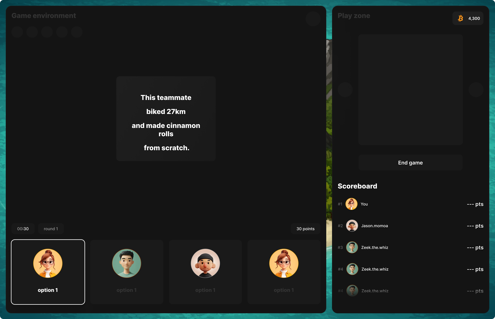

# Teamverse Frontend 🕹️

**Teamverse**  is a gamified team-bonding platform reimagining how remote teams connect beyond the screen. In an increasingly distributed world, many professionals work side-by-side virtually, yet barely know the people they collaborate with daily. This lack of connection silently erodes team culture, fuels burnout, and limits the power of true collaboration.

We’re building Teamverse to change that — to transform remote workplaces into communities. Through games, Teamverse helps teams build trust, reduce isolation, and rediscover the joy of working together.

But Teamverse isn’t just about connection — it’s about access. We’re using blockchain not for speculation, but for inclusion. With seamless onboarding via Argent Invisible Wallet, we're introducing Web2 users to Web3 without friction — proving that blockchain can power meaningful, human-first experiences.

---



---

## 🚀 Getting Started

Clone the repository:

```bash
git clone https://github.com/zintarh/teamverse-frontend.git
cd teamverse-frontend
Install dependencies:
npm install
# or
yarn install
```

Start the development server:

```bash
npm run dev
# or
yarn dev
Open http://localhost:3000 in your browser to view the app.

```

#### ⚙️ Tech Stack
Next.js – App Router for performance & flexibility

Tailwind CSS – Utility-first styling

Radix UI – Accessible UI primitives

TypeScript – Type safety

Next Font – Optimized Geist font

Argent Invisible Wallet – Frictionless Web3 onboarding


#### 🧑‍💻 Contributing
We're open to contributions! If you have suggestions or want to fix something, feel free to:

Fork this repository

Create your feature branch:
git checkout -b feat/amazing-feature

Commit your changes:
git commit -m 'Add amazing feature'

Push to the branch:
git push origin feat/amazing-feature

Open a pull request

🧪 Environment Variables
Create a .env.local file and configure the necessary variables. Use .env.example as a reference if available.

📜 License
text
Copy
Edit
MIT License

Copyright (c) 2025 Zintarh

